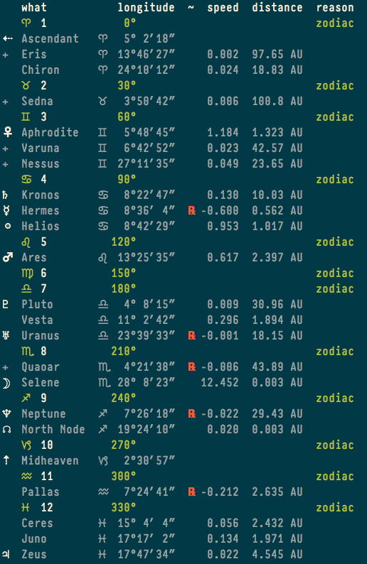

eden(1) -- Astrolet's command line interface ephemeris
======================================================

## SYNOPSIS

`eden [<options>]`

## DESCRIPTION

The `eden help` command will soon be implemented to provide details.

Here is an `eden -e` example:

## NAVIGATE

Index(7), Home(7)
